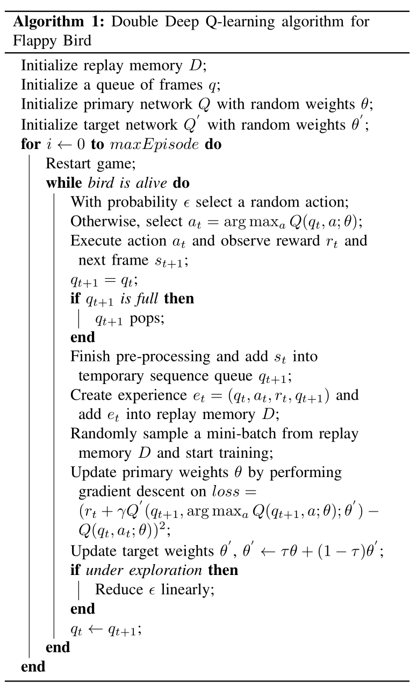

# Apply Deep Reinforcement Learning to Flappy Bird


video: [Apply Deep Reinforcement Learning to Flappy Bird](https://youtu.be/a6VD9vVrOOI)

## Overview
Reinforcement learning is widely used to solve the
problem with abstract representation and under uncertainty. In
this project, we show how deep reinforcement learning could
be applied to the game Flappy Bird effectively. This problem is
quite challenging because we only provide the model with high
dimensional input, which means it must learn these representa-
tions directly to develop an optimal strategy. We show that our
model can achieve super-human performance. Furthermore, we
implemented Double DQN with attention mechanism and shows
that it outperforms DQN in the given setting.

## Installation Dependencies:
* Python or 3
* TensorFlow 2
* pygame
* OpenCV-Python

## How to Run?
```
git clone https://github.com/QLightman/CS394R_Final_Project
cd CS394R_Final_Project
python double_DQN.py
```


## Double Q-Network Algorithm




## References

[1] Hessel M, Modayil J, Van Hasselt H, et al. Rainbow: Combining improvements in deep reinforcement
learning[C]//Thirty-Second AAAI Conference on Artificial Intelligence. 2018.

[2] Mnih V, Kavukcuoglu K, Silver D, et al. Human-level control through deep reinforcement learning[J]. Nature,
2015, 518(7540): 529.

[3] Li Y. Deep reinforcement learning: An overview[J]. arXiv preprint arXiv:1701.07274, 2017.

[4] Fortunato M, Azar M G, Piot B, et al. Noisy networks for exploration[J]. arXiv preprint arXiv:1706.10295, 2017.

[5] Dabney W, Rowland M, Bellemare M G, et al. Distributional reinforcement learning with quantile
regression[C]//Thirty-Second AAAI Conference on Artificial Intelligence. 2018.

[6] Wang Z, Schaul T, Hessel M, et al. Dueling network architectures for deep reinforcement learning[J]. arXiv
preprint arXiv:1511.06581, 2015.

[7] Chen K. Deep reinforcement learning for flappy bird[J]. 2015.

[8] Appiah N, Vare S. Playing FlappyBird with Deep Reinforcement Learning[J]. 2018.

[9] Justesen N, Bontrager P, Togelius J, et al. Deep learning for video game playing[J]. IEEE Transactions on
Games, 2019.

[10] Van Hasselt H, Guez A, Silver D. Deep reinforcement learning with double q-learning[C]//Thirtieth AAAI
conference on artificial intelligence. 2016.

[11] Mnih V, Badia A P, Mirza M, et al. Asynchronous methods for deep reinforcement learning[C]//International
conference on machine learning. 2016: 1928-1937.
## Disclaimer
This work is highly based on the following repos:

1. [yenchenlin/DeepLearningFlappyBird](https://github.com/yenchenlin/DeepLearningFlappyBird)


